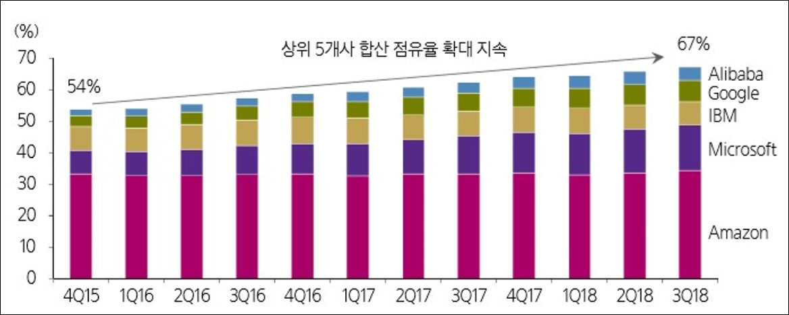
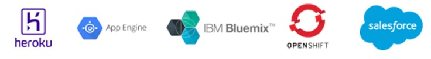
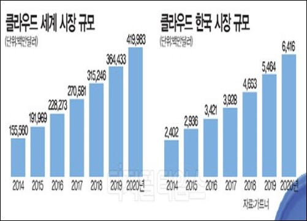
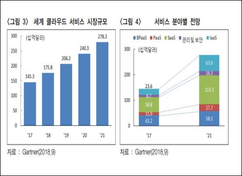
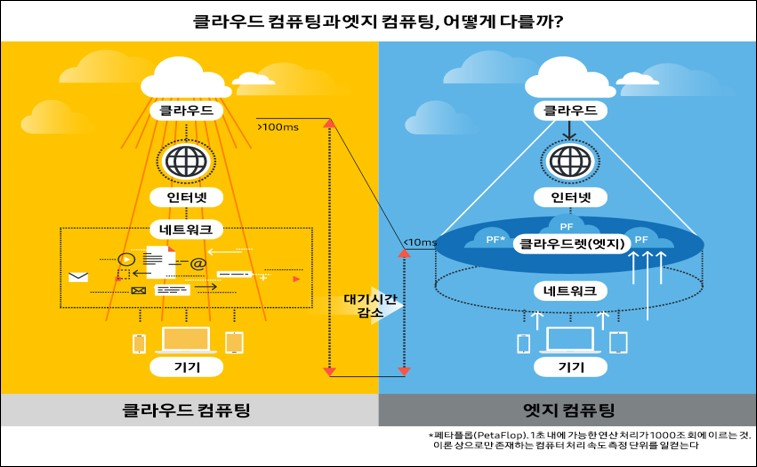

# 클라우드 컴퓨팅

### 목차

1. ##### 클라우드 컴퓨팅

   > 1) 클라우드 컴퓨팅이란?
   >
   > 2) 클라우드 컴퓨팅이 각광받는 이유

2. ##### 클라우드 컴퓨팅 서비스 종류

   > 1)  App 서비스 기존 과정
   >
   > 2)  Iaas (Infrastructure as a Service)
   >
   > 3)  Paas (Platform as a Service)
   >
   > 4)  Saas (Software as a Service)

3.  ##### 클라우드 컴퓨팅 기술동향 및 미래 전망

   > 1) 클라우드 컴퓨팅 기술동향
   >
   > 2) 클라우드 컴퓨팅 시장 전망
   >
   > 3) 클라우드 컴퓨팅 기술 전망
   >
   > 4) 클라우드 컴퓨팅 트렌드

----

### 1. 클라우드 컴퓨팅

---

#### 	1) 클라우드 컴퓨팅이란?

```
인터넷 상의 서버를 통하여 데이터 저장, 네트워크, 콘텐츠 사용 등 IT 관련 서비스를 한번에 사용할 수 있는 컴퓨팅 환경
```

쉽게 말해, 고성능 컴퓨터가 업무를 대신 처리하는 기술이라고 할 수 있다. 사용자는 데이터 저장 및 처리, 콘텐츠 사용 등을 중앙의 고성능 컴퓨터에 맡기는 것이다. 그리고 이용자는 언제 어디서든 중앙 컴퓨터로부터 데이터를 끌어 와 사용할 수 있다.

클라우드 컴퓨팅은 4차산업의 핵심 키워드로서 다양한 회사들이 뛰어들고 있는 사업이다.


#### 	2) 클라우드 컴퓨팅이 각광받는 이유

* **개인**  : 두 손 가볍게 다녀도 언제 어디서나 올려놓은 데이터를 이용할 수 있다.

​	~~최근 카카오 페이, 삼성 페이 등 여러 페이 서비스를 이용하는 가장 큰 이유는 지갑을 들고 다니지 않아도 되는 간편함 때문이다.~~

우리가 현재 흔히 사용하고 있는 N Cloud, I Cloud 같은 서비스들도 클라우드 컴퓨팅을 이용한 서비스의 일부이다. 이러한 서비스 덕분에 우리는 개인 PC나 외장하드, 이동식 메모리를 들고 다니지 않아도 언제 어디서나 본인이 올려놓은 클라우드로부터 데이터를 끌어와 쓸 수 있다.


* **기업** :  관리 포인트가 줄고 물리적 장비를 별도로 관리하지 않아도 되기 때문에 비용이 절감된다. 또한  운영도  	훨씬 간편하다.

클라우드 컴퓨팅 기술을 이용하여 클라우드 서비스를 제공하는 대표적인 회사로 아마존을 꼽을 수 있다.  




위의 도표를 통해 알 수 있듯이 AWS(Amazon Web Service)는 독보적인 시장 점유율 추이를 보인다. 그 뒤로 Microsoft에서 제공하는 Azure가 높은 비율을 차지하고 있지만, 아직 AWS를 따라가기는 힘들다. 

AWS의 주요 대상은 기업과 개발자이다. 

기존에는 IDC(인터넷데이터센터)에 맡기거나 회사 자체에 직접 구축하여 운영 해야 했다.  하지만 이제는 기업의 ICT자원들을 AWS 클라우드 서비스를 이용하여 쉽고 간편하게 운영할 수 있다.


---

### 2.클라우드 컴퓨팅 서비스 종류

---

#### 	1)  App 서비스 기존 과정

```
사용자가 직접 인프라와 플랫폼, 애플리케이션까지 모두 구성하여 관리해야 한다.
```

##### 문제점

-  물리적인 장치, 하드웨어 구매 및 OS 설치 직접 필요
- 네트워크 환경을 직접 구성
- 직접적으로 서버 관리 필요(트래픽)
- 돈과 시간 소비 증가


	#### 	2) Iaas (infrastructure as a Service)

```
사업자가 인프라(컴퓨터, 네트워킹, 저장소, 가상서버)를 제공합니다.
```

##### 장점

* 사용자는 하드웨어 관리에 신경 쓸 필요가 없습니다.
* 운영체제 레벨까지 관리하고 컨트롤 할 수 있습니다.

##### 단점

* 가상서버 하위의 레벨에 대해서는 접근하거나 컨트롤할 수 없습니다.
* 하드에어와 서버만 제공받기 때문에 여전히 사용자가 관리해야 할 부분이 많습니다.

##### 대표서비스

+ AWS(Amazon Web Service)


#### 3) Paas (Platform as a Service)

```
사업자가 인프라와 플랫폼(PHP, MySQL ```), 운영체제까지 제공합니다.
```

##### 장점

* 사용자는 애플리케이션 개발에 집중하며 빠르게 서비스를 제공할 수 있게 됩니다.
* 사용자가 관리해야 하는 범위가 크게 줄어들고 편리해집니다.

##### 단점

* 플랫폼과 운영체제를 관리하거나 컨트롤 할 수 없습니다.
* 애플리케이션이 플랫폼에 종속되며 플랫폼간의 이동이 어려울 수 있습니다.

##### 대표서비스




	#### 	4) SaaS(Software as a Service)

```
사업자가 모든 것을 제공합니다.
```

##### 장점

* 클라우드에 있는 SW를 웹을 통해 언제 어디서나 사용할 수 있습니다.
* 사용하기 매우 쉽고, 최신 SW 업데이트를 빠르게 제공받을 수 있습니다.


##### 단점

* 반드시 인터넷에 접속할 수 있어야 하며 데이터 노출에 대한 위험이 있습니다.


##### 대표 서비스

* 네이버 클리우드
* 드롭박스
* Microsoft Office 365

---

### 3.클라우드 컴퓨팅 기술동향 및 미래 전망

---

	#### 	1) 클라우드 컴퓨팅 기술동향


클라우드 컴퓨팅 기반의 서비스를 제공하기 위해서는 하드웨어 장비 인프라가 

갖춰져 있는 데이터 센터 구축이 선행되어야 하며, 주문형 서비스, 동적 자원할당,

 데이터 동기화 등 클라우드의 특징을 충족하기 위한 다양한 기술 솔루션이 요구됨


##### <클라우드 컴퓨팅 주요 기술 3가지>


> [1] 가상화 기술

하드웨어, 저장장치 등의 물리적인 리소스의 특성들을 감추며 IT 자원을 제공하는 기술

Ex) Vmware, KT U Cloud Biz


> [2] 대규모 분산처리 기술

대규모 서버 환경에서 대용량 데이터를 분산 처리하는 기술

Ex) LoadBalance, Autoscaling

사례) 이벤트 사이트 접속 폭주시


> [3] 오픈 인터페이스

인터넷을 통해 서비스를 이용하고 서비스간 정보 공유를 지원하는 인터페이스 기술

Ex) SOA, Open API


	#### 	2) 클라우드 컴퓨팅 시장 전망

리서치 업체 가트너에 따르면 세계 클라우드 서비스 시장의 규모는 2017년 기준 2706억 달러에서 2020년에는 4200달러로 약 50%이상 성장이 예상되는 4차 산업혁명을 대표하는 산업.






가트너는 ‘17년부터 21년까지 전 세계 공용 클라우드 시장이 연평균 약 17.6%씩 성장할 것으로 예상


#### 	3) 클라우드 컴퓨팅 기술 전망

  5G와 클라우드를 사용하여 게임을 실시간 스트리밍으로 플레이

   \- 크롬 기반 디바이스라면 모바일이나 PC, TV등 운영체제를 가리지 않고 접속할 수 있는 것이 장점


​    예) 구글의 스태디아(STAIDA)

[스태디아 전체 발표 영상(GDC 2019)]: https://blog.naver.com/haleejjang1/221492565981


#### 	4) 클라우드 컴퓨팅 트렌드


